# 📘 INT411 — Software Project Management
## UNIT II: Software Effort Estimation & Activity Planning
**Lectures 6–10 (50 minutes each) | B.Tech 4th Year**

> **Unit II Syllabus Coverage:** Problems of Estimation · Estimation Techniques (Expert Judgement, Delphi, Analogy, Algorithmic) · Albrecht Function Point Analysis · COCOMO Model (Basic, Intermediate, Detailed) · Activity Planning Objectives · Project Schedules · Network Planning Models · Forward Pass & Backward Pass · Identifying the Critical Path · Activity Float · Shortening Project Duration

---

### 🗺️ Unit Roadmap

```mermaid
gantt
    title Unit II — 5 Lecture Plan
    dateFormat  X
    axisFormat %d
    section Estimating Effort
    L6 Estimation Problems and Techniques   :l1, 0, 1
    section Sizing the Job
    L7 Function Point Analysis              :l2, 1, 2
    section Modelling Effort
    L8 COCOMO Model                         :l3, 2, 3
    section Sequencing Work
    L9 Activity Planning and Networks       :l4, 3, 4
    section Scheduling the Network
    L10 Forward/Backward Pass and Float     :l5, 4, 5
```

| Lecture | Theme | Core Question Answered |
|---|---|---|
| 6️⃣ | Estimating Effort | Why is estimation so hard, and what techniques exist? |
| 7️⃣ | Sizing the Job | How do we measure "how big" the software is, objectively? |
| 8️⃣ | Modelling Effort | Given a size, how much effort (person-months) will it take? |
| 9️⃣ | Sequencing Work | In what order must activities happen, and how do we draw that? |
| 🔟 | Scheduling the Network | What is the earliest/latest each activity can happen, and what's our critical path? |

---
---

## 🎯 LECTURE 6 — Problems of Estimation & Estimation Techniques

### 6.1 Why Software Effort Estimation Is Hard 🎲

> **Definition:** **Effort estimation** is the process of predicting the most realistic amount of effort (in person-hours/person-months) required to develop or maintain software, based on incomplete, uncertain, or noisy input.

**Why it goes wrong, visually:**

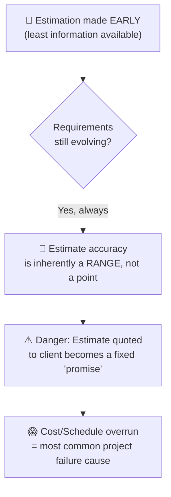

📝 **Know-how:** The **Cone of Uncertainty** shows that at the "Initial Concept" stage, an estimate can be off by **4× too high to 4× too low**. Only after detailed design does the estimate converge near ±10%. Never present an early estimate as an exact number — always give a **range**.

**Consequences of poor estimation:**

| Problem | Effect |
|---|---|
| 📉 **Underestimation** | Death-march schedules, burnout, corners cut on testing/quality |
| 📈 **Overestimation** | Parkinson's Law kicks in — "work expands to fill the time available"; loses the bid/tender |
| 🔁 **No re-estimation** | Original guess is treated as gospel even after requirements change |

---

### 6.2 The Estimation Technique Family Tree 🌳

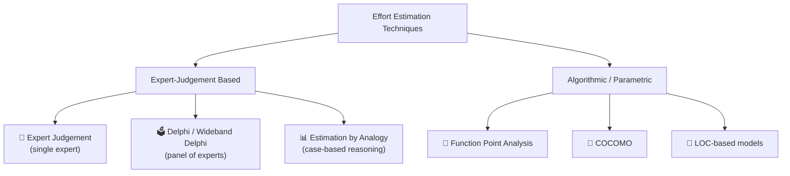

#### (a) Expert Judgement 👤
One or more experienced people estimate effort based on prior similar projects. Fast, cheap — but **subjective** and hard to justify to a client.

#### (b) Delphi Technique / Wideband Delphi 🗳️
Removes bias by using a **panel** of experts who estimate **independently**, then discuss anonymously, and **converge** over rounds.

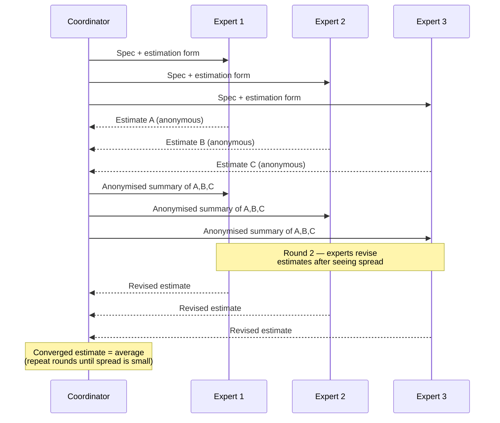

📝 **Know-how:** "**Wideband**" Delphi adds a *group discussion meeting* between rounds (the original 1940s Delphi method kept experts fully anonymous and non-communicating). This is the version most used in industry today.

#### (c) Estimation by Analogy (Case-Based Reasoning) 📊
Find the **most similar past project**, then scale its actual effort by the size/complexity ratio.

```python
# Simple analogy-based estimation
past_project_loc = 12000       # size of a similar, completed project
past_project_effort_pm = 24    # its actual effort, in person-months

new_project_loc = 15000        # size of the new project (estimated)

# Scale effort proportionally to size ratio
estimated_effort_pm = past_project_effort_pm * (new_project_loc / past_project_loc)
print(f"Estimated effort for new project: {estimated_effort_pm:.1f} person-months")
# Output → Estimated effort for new project: 30.0 person-months
```

⚠️ **Warning:** Analogy only works if you have a *genuinely comparable* past project (same domain, similar team, similar tech stack) — comparing a mobile app to a mainframe batch system will mislead you badly.

---

### ✅ Checkpoint — End of Lecture 6

<details><summary>Click to reveal self-check questions</summary>

- Why does the *Cone of Uncertainty* mean early estimates should be given as a range?
- What is the key difference between plain Delphi and **Wideband** Delphi?
- In estimation by analogy, what single assumption can make the estimate badly wrong?
- Name one risk of **under**-estimating and one risk of **over**-estimating a project.

</details>

---
---

## 🎯 LECTURE 7 — Albrecht Function Point Analysis (FPA)

### 7.1 Why Not Just Count Lines of Code? 📏

> **Problem with LOC (Lines of Code):** LOC is language-dependent (100 lines of Python ≠ 100 lines of Java in functionality), can't be measured until code *exists*, and rewards verbose coding.

**Function Points (FP)** measure software size from the **user's/functional** point of view — independent of programming language — making them usable as early as the requirements stage.

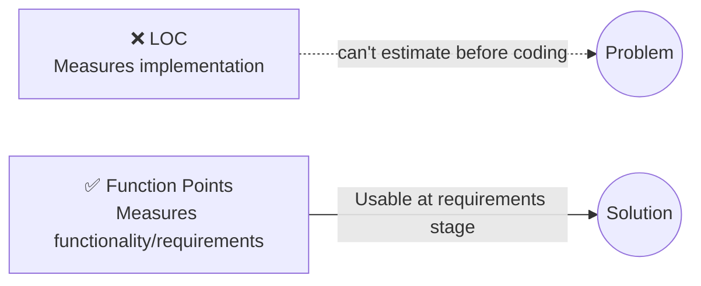

---

### 7.2 The Five FP Components 🧩

Albrecht's method classifies every requirement into 5 function types:

| Type | Symbol | Meaning | Example |
|---|---|---|---|
| 🔵 **External Input** | EI | Data entering the system that changes its behaviour | "Add New Employee" form |
| 🟢 **External Output** | EO | Data leaving the system, often derived/calculated | Monthly payroll report |
| 🟡 **External Inquiry** | EQ | Input+output pair with **no** derived data (simple lookup) | "Search Employee by ID" |
| 🟣 **Internal Logical File** | ILF | Data maintained **inside** the system | `Employees` table |
| 🟠 **External Interface File** | EIF | Data referenced but maintained by **another** system | Tax-rate data from Govt. API |

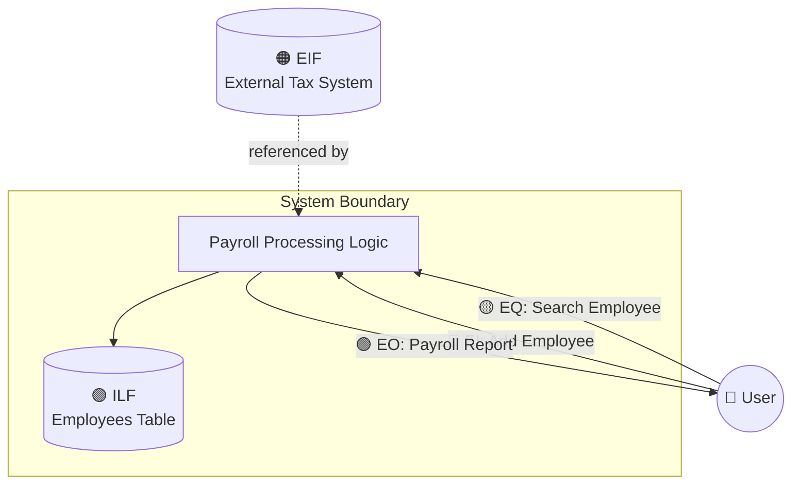

---

### 7.3 Step-by-Step FP Calculation 🧮

**Step 1 — Classify each component's complexity** (Low / Average / High) using standard weight tables:

| Component | Low | Average | High |
|---|---|---|---|
| EI | 3 | 4 | 6 |
| EO | 4 | 5 | 7 |
| EQ | 3 | 4 | 6 |
| ILF | 7 | 10 | 15 |
| EIF | 5 | 7 | 10 |

**Step 2 — Compute Unadjusted Function Points (UFP):**

$$UFP = \sum (\text{count of each component} \times \text{its complexity weight})$$

**Step 3 — Compute the Value Adjustment Factor (VAF)** using 14 General System Characteristics (GSCs) — e.g., data communications, performance, reusability, operational ease — each rated 0 (no influence) to 5 (strong influence):

$$VAF = 0.65 + \left(0.01 \times \sum_{i=1}^{14} GSC_i \right)$$

**Step 4 — Compute Adjusted Function Points:**

$$FP = UFP \times VAF$$

**Worked example (illustrative, minimal):**

```python
# --- Step 1 & 2: Unadjusted Function Points ---
components = {
    "EI":  {"count": 4, "weight": 4},   # 4 average-complexity inputs
    "EO":  {"count": 2, "weight": 5},   # 2 average-complexity outputs
    "EQ":  {"count": 3, "weight": 3},   # 3 low-complexity inquiries
    "ILF": {"count": 2, "weight": 10},  # 2 average-complexity internal files
    "EIF": {"count": 1, "weight": 5},   # 1 low-complexity external file
}

UFP = sum(c["count"] * c["weight"] for c in components.values())
print(f"Unadjusted Function Points (UFP) = {UFP}")

# --- Step 3: Value Adjustment Factor ---
sum_gsc = 35   # sum of all 14 GSC ratings (each 0-5), example value
VAF = 0.65 + (0.01 * sum_gsc)
print(f"VAF = {VAF}")

# --- Step 4: Adjusted Function Points ---
FP = UFP * VAF
print(f"Adjusted Function Points = {FP:.1f}")
```
**Output:**
```
Unadjusted Function Points (UFP) = 61
VAF = 1.0
Adjusted Function Points = 61.0
```

📝 **Know-how:** Once you have `FP`, you can convert it to estimated LOC using a language-specific **"backfiring" table** (e.g., 1 FP ≈ 53 LOC in C, ≈ 29 LOC in Java) and then feed that LOC into a COCOMO-style effort model — this is exactly what Lecture 8 does.

---

### ✅ Checkpoint — End of Lecture 7

<details><summary>Click to reveal self-check questions</summary>

- Why can Function Points be counted before a single line of code is written, unlike LOC?
- Classify: a "Generate Invoice PDF" feature — is it an EO or an EQ? Why?
- What does the VAF adjust for, and what's the minimum/maximum multiplier it can apply (hint: 14 GSCs × 0–5 each)?
- If UFP = 80 and VAF = 1.10, what is the Adjusted FP?

</details>

---
---

## 🎯 LECTURE 8 — The COCOMO Model

### 8.1 What Is COCOMO? 🧮

> **Definition: COCOMO** (**CO**nstructive **CO**st **MO**del), by Barry Boehm, is an **algorithmic** cost model that estimates effort and duration as a mathematical function of estimated project **size in KLOC** (thousands of lines of code).

**Three project classes (modes) in Basic COCOMO:**

| Mode | Characteristics | Example |
|---|---|---|
| 🟢 **Organic** | Small team, familiar domain, flexible requirements | Simple inventory app, < 50 KLOC |
| 🟡 **Semi-detached** | Mixed team experience, moderate complexity | College ERP system, 50–300 KLOC |
| 🔴 **Embedded** | Tight constraints (hardware, real-time, safety-critical) | Flight control software, > 300 KLOC |

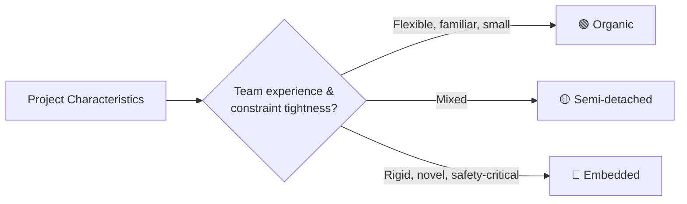

---

### 8.2 Basic COCOMO — The Core Formulas 📐

$$Effort = a \times (KLOC)^b \quad \text{(person-months)}$$
$$Duration = c \times (Effort)^d \quad \text{(months)}$$

| Mode | a | b | c | d |
|---|---|---|---|---|
| Organic | 2.4 | 1.05 | 2.5 | 0.38 |
| Semi-detached | 3.0 | 1.12 | 2.5 | 0.35 |
| Embedded | 3.6 | 1.20 | 2.5 | 0.32 |

**Worked example — Basic COCOMO (illustrative, minimal):**

```python
def basic_cocomo(kloc, mode="organic"):
    coeffs = {
        "organic":       {"a": 2.4, "b": 1.05, "c": 2.5, "d": 0.38},
        "semi-detached": {"a": 3.0, "b": 1.12, "c": 2.5, "d": 0.35},
        "embedded":      {"a": 3.6, "b": 1.20, "c": 2.5, "d": 0.32},
    }
    a, b, c, d = coeffs[mode].values()
    effort = a * (kloc ** b)        # person-months
    duration = c * (effort ** d)    # months
    team_size = effort / duration   # average people needed
    return effort, duration, team_size

effort, duration, team = basic_cocomo(kloc=50, mode="organic")
print(f"Effort   = {effort:.1f} person-months")
print(f"Duration = {duration:.1f} months")
print(f"Team size ≈ {team:.1f} people")
```
**Output:**
```
Effort   = 150.8 person-months
Duration = 15.5 months
Team size ≈ 9.7 people
```

📝 **Know-how:** Notice `b > 1` in every mode. This mathematically encodes **Brooks's Law territory** — effort grows *faster* than size (diseconomy of scale), because bigger projects need disproportionately more communication and coordination overhead.

---

### 8.3 Intermediate COCOMO — Adding Cost Drivers 🎛️

Basic COCOMO ignores *how* the project is run. **Intermediate COCOMO** multiplies the effort by an **Effort Adjustment Factor (EAF)** derived from **15 cost drivers** (e.g., product reliability, programmer capability, use of tools, required schedule) each rated Very Low → Extra High.

$$Effort_{intermediate} = a \times (KLOC)^b \times EAF$$

```python
# Example cost drivers (ratings simplified to multipliers)
cost_drivers = {
    "Required software reliability": 1.15,   # High
    "Product complexity":            1.00,   # Nominal
    "Programmer capability":         0.86,   # High (skilled team lowers effort)
    "Use of software tools":         0.91,   # High
    "Required development schedule": 1.00,   # Nominal
}

EAF = 1
for driver, multiplier in cost_drivers.items():
    EAF *= multiplier

basic_effort = 150.8   # from Basic COCOMO above
intermediate_effort = basic_effort * EAF
print(f"EAF = {EAF:.3f}")
print(f"Intermediate COCOMO Effort = {intermediate_effort:.1f} person-months")
```
**Output:**
```
EAF = 0.902
Intermediate COCOMO Effort = 136.0 person-months
```

**Detailed COCOMO** (mentioned for completeness) goes one step further — it applies cost drivers **per development phase** (planning, design, coding, testing) rather than to the whole project uniformly, giving phase-level sensitivity.

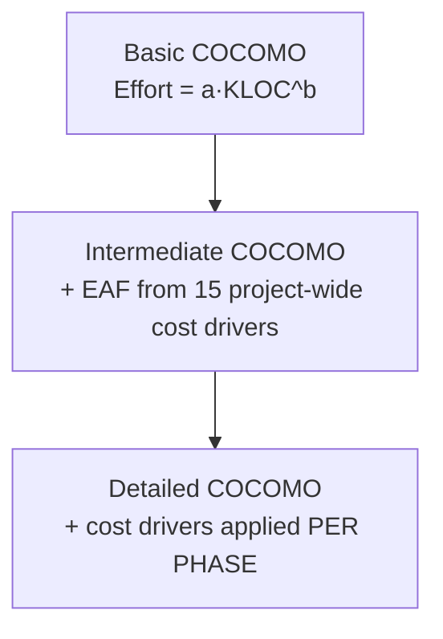

---

### ✅ Checkpoint — End of Lecture 8

<details><summary>Click to reveal self-check questions</summary>

- Why does `b > 1` in the COCOMO effort formula reflect a real-world project management truth?
- A flight-control system would use which COCOMO mode, and why?
- What does the EAF multiplier represent, and what does a value < 1.0 mean for the team?
- What's the key structural difference between Intermediate and Detailed COCOMO?

</details>

---
---

## 🎯 LECTURE 9 — Activity Planning & Network Diagrams

### 9.1 Objectives of Activity Planning 🎯

> **Definition:** **Activity planning** breaks a project down into individual **activities**, determines their **sequence and dependencies**, and estimates duration/resources for each — the foundation for the project schedule.

**Why activity planning matters:**

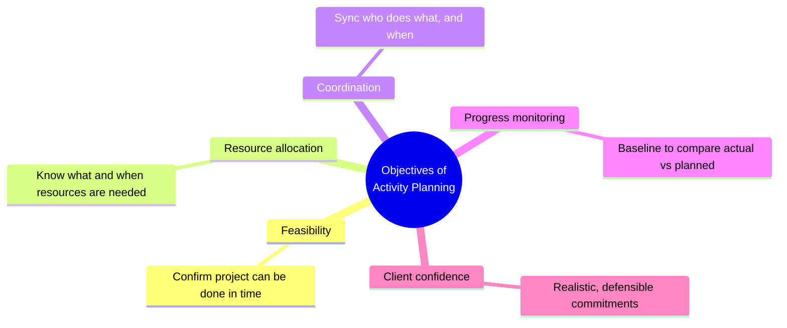

---

### 9.2 Projects, Activities & Milestones 🚩

| Term | Meaning |
|---|---|
| **Activity** | A task that consumes **time and resources** (e.g., "Design database schema") |
| **Milestone** | An **event** marking completion of a key stage — has **zero duration** (e.g., "Design signed-off") |
| **Sequencing** | Deciding the *order* activities must occur, based on **dependencies** |

**Dependency types:**

| Type | Meaning | Example |
|---|---|---|
| 🔗 **Mandatory (hard logic)** | Physically must happen in this order | Can't test code before it's written |
| 🤝 **Discretionary (soft logic)** | A chosen best-practice order, not physically forced | Team prefers UI design before backend, but could swap |
| 🌐 **External** | Depends on something outside the project | Waiting on 3rd-party API access approval |

---

### 9.3 Network Diagram Notations: AOA vs AON 🕸️

Two ways to draw the same dependency logic:

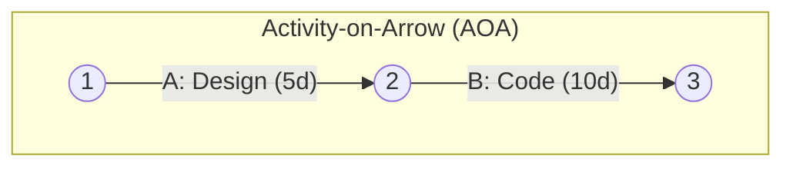

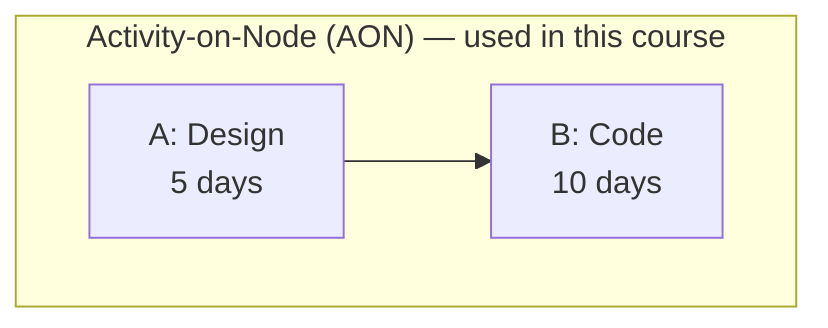

| Notation | Activities represented as | Events represented as | Modern usage |
|---|---|---|---|
| **AOA** | Arrows | Numbered circles (nodes) | Older, needs "dummy activities" for complex logic |
| **AON** (Precedence Diagram) | Boxes/nodes | Implied by arrows | ✅ Industry-standard today (MS Project, Primavera) |

---

### 9.4 Building an AON Network from a Precedence Table 🏗️

**Worked example — a small feature-release project:**

| Activity | Description | Duration (days) | Predecessor(s) |
|---|---|---|---|
| A | Requirements gathering | 3 | — |
| B | UI Design | 4 | A |
| C | Database Design | 3 | A |
| D | Backend Coding | 6 | C |
| E | Frontend Coding | 5 | B |
| F | Integration | 2 | D, E |
| G | Testing | 3 | F |

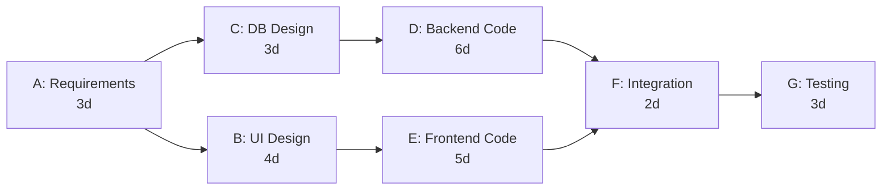

📝 **Know-how:** Reading this diagram: **F (Integration)** cannot start until **both** D and E are finished — this "convergence point" is exactly where schedule risk hides, because it only takes the *slower* of the two incoming paths to delay the whole project. Lecture 10 quantifies this precisely.

---

### ✅ Checkpoint — End of Lecture 9

<details><summary>Click to reveal self-check questions</summary>

- What is the one key difference between an "activity" and a "milestone"?
- Give one example each of a mandatory, discretionary, and external dependency in a software project.
- Why is AON (precedence diagramming) preferred over AOA in modern tools?
- In the worked example above, why is activity **F** a natural risk point in the schedule?

</details>

---
---

## 🎯 LECTURE 10 — Forward Pass, Backward Pass, Critical Path & Float

### 10.1 The Four Key Timing Values per Activity ⏱️

For every activity, Critical Path Method (CPM) computes four numbers:

| Symbol | Meaning |
|---|---|
| **EST** | Earliest Start Time — earliest an activity can begin |
| **EFT** | Earliest Finish Time = EST + Duration |
| **LST** | Latest Start Time — latest it can begin without delaying the project |
| **LFT** | Latest Finish Time — latest it can finish without delaying the project |

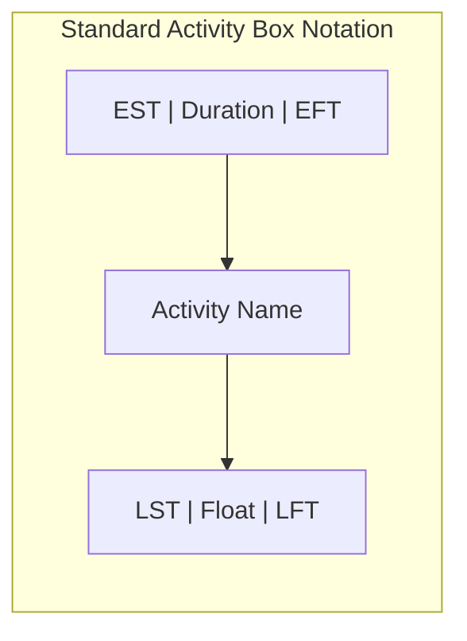

---

### 10.2 Forward Pass — Computing EST & EFT ➡️

**Rule:** Start at the first activity with `EST = 0`. Move left→right:
$$EFT = EST + Duration$$
$$EST_{\text{next}} = \max(EFT \text{ of all predecessors})$$

**Applying to our Lecture 9 example:**

```python
activities = {
    "A": {"dur": 3, "preds": []},
    "B": {"dur": 4, "preds": ["A"]},
    "C": {"dur": 3, "preds": ["A"]},
    "D": {"dur": 6, "preds": ["C"]},
    "E": {"dur": 5, "preds": ["B"]},
    "F": {"dur": 2, "preds": ["D", "E"]},
    "G": {"dur": 3, "preds": ["F"]},
}

# ---- FORWARD PASS ----
for name, act in activities.items():
    if not act["preds"]:
        act["EST"] = 0
    else:
        act["EST"] = max(activities[p]["EFT"] for p in act["preds"])
    act["EFT"] = act["EST"] + act["dur"]

for name, act in activities.items():
    print(f"{name}: EST={act['EST']:>2}  EFT={act['EFT']:>2}")
```
**Output:**
```
A: EST= 0  EFT= 3
B: EST= 3  EFT= 7
C: EST= 3  EFT= 6
D: EST= 6  EFT=12
E: EST= 7  EFT=12
F: EST=12  EFT=14
G: EST=14  EFT=17
```

➡️ **Project Duration = 17 days** (the final EFT).

---

### 10.3 Backward Pass — Computing LST & LFT ⬅️

**Rule:** Start at the **last** activity with `LFT = Project Duration`. Move right→left:
$$LST = LFT - Duration$$
$$LFT_{\text{prev}} = \min(LST \text{ of all successors})$$

```python
project_duration = max(a["EFT"] for a in activities.values())

# Build successor map first
successors = {name: [] for name in activities}
for name, act in activities.items():
    for p in act["preds"]:
        successors[p].append(name)

# ---- BACKWARD PASS (process in reverse topological order) ----
order = ["G", "F", "E", "D", "C", "B", "A"]
for name in order:
    act = activities[name]
    if not successors[name]:
        act["LFT"] = project_duration
    else:
        act["LFT"] = min(activities[s]["LST"] for s in successors[name])
    act["LST"] = act["LFT"] - act["dur"]

for name, act in activities.items():
    print(f"{name}: LST={act['LST']:>2}  LFT={act['LFT']:>2}")
```
**Output:**
```
A: LST= 0  LFT= 3
B: LST= 3  LFT= 7
C: LST= 4  LFT= 7
D: LST= 6  LFT=12
E: LST= 7  LFT=12
F: LST=12  LFT=14
G: LST=14  LFT=17
```

---

### 10.4 Total Float & the Critical Path 🔑

$$\text{Total Float} = LST - EST \; (= LFT - EFT)$$

> **Critical Path:** the sequence of activities with **zero float** — any delay here delays the *entire* project.

```python
print(f"{'Act':<4}{'EST':>4}{'EFT':>4}{'LST':>4}{'LFT':>4}{'Float':>7}  Critical?")
critical_path = []
for name, act in activities.items():
    float_ = act["LST"] - act["EST"]
    is_critical = float_ == 0
    if is_critical:
        critical_path.append(name)
    print(f"{name:<4}{act['EST']:>4}{act['EFT']:>4}{act['LST']:>4}{act['LFT']:>4}{float_:>7}  {'🔴 YES' if is_critical else '🟢 no'}")

print(f"\nCritical Path: {' → '.join(critical_path)}")
```
**Output:**
```
Act  EST EFT LST LFT  Float  Critical?
A      0   3   0   3      0  🔴 YES
B      3   7   3   7      0  🔴 YES
C      3   6   4   7      1  🟢 no
D      6  12   6  12      0  🔴 YES
E      7  12   7  12      0  🔴 YES
F     12  14  12  14      0  🔴 YES
G     14  17  14  17      0  🔴 YES

Critical Path: A → B → D → E → F → G
```

Visualised (critical path highlighted):

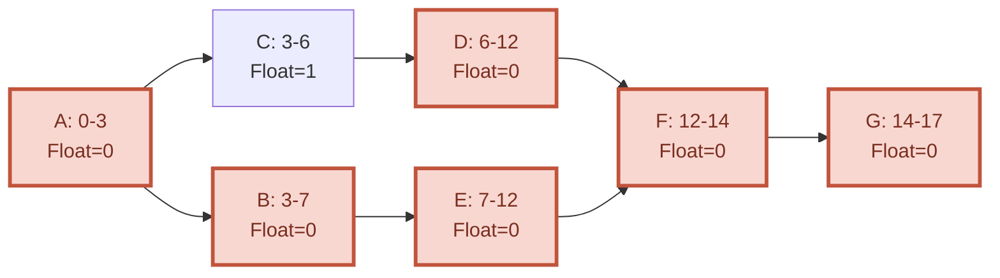

⚠️ **Common exam mistake:** Note activity **C** has **1 day of float** even though it feeds into the critical chain via D — because C finishes at day 6 but D can't start until 6 anyway (D's *other* dependency path, via C, isn't the bottleneck — check the raw numbers, don't eyeball it!). Always compute float numerically.

---

### 10.5 Shortening the Project Duration (Crashing) ⚡

To finish earlier, you must reduce duration on a **critical-path** activity (shortening a non-critical activity like C wastes money — it has slack already!).

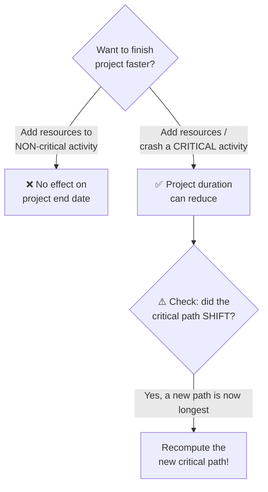

📝 **Know-how:** This is why "throwing more people at a late project" (Brooks's Law) only helps if applied to genuinely **critical-path** work — and even then, communication overhead can outweigh the gain (Lecture 8's `b > 1` insight, again).

---

### ✅ Checkpoint — End of Lecture 10 (Unit II Wrap-up)

<details><summary>Click to reveal self-check questions</summary>

- State the two formulas used in the Forward Pass and the two used in the Backward Pass.
- Why must the Backward Pass be computed in **reverse** topological order?
- Define Total Float in one line, and state what a float of 0 means for an activity.
- In the worked example, why does shortening activity **C** *not* shorten the 17-day project?
- Self-test: 5 FP components · COCOMO's 3 modes · EAF meaning · Critical Path definition.

</details>

---

### 🧠 Unit II — Full Recap Mind-Map

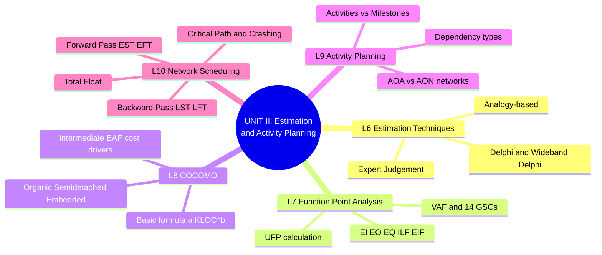

---

### 📚 Suggested Practice for Students

1. Given UFP = 120 and a sum of 14 GSCs = 40, compute the Adjusted Function Points.
2. Using Basic COCOMO, compute Effort and Duration for a 90 KLOC **embedded**-mode project.
3. Draw an AON network for a 6-activity project of your choice (your own mini-project/capstone) and identify the critical path by hand.
4. For any network with ≥ 2 parallel paths, prove numerically why the *longer* path — not the *shorter* one — determines the critical path.

---

*INT411 · Software Project Management — Unit II Study Material · 5 Lectures, 50 minutes each*
