# 📘 INT411 — Software Project Management
## UNIT I: Introduction to Software Project Management
**Lectures 1–5 (50 minutes each) | B.Tech 4th Year**

> **Unit I Syllabus Coverage:** Software Project vs Other Projects · Categorization of Software Projects · Setting Objectives · Business Case · Project Portfolio Management · Cost-Benefit Evaluation Techniques · Risk Evaluation · Selection of an Appropriate Project Approach · Project Life Cycle (Waterfall, Spiral, RAD, Agile)

---

### 🗺️ Unit Roadmap

```mermaid
gantt
    title Unit I — 5 Lecture Plan
    dateFormat  X
    axisFormat %d
    section Foundations
    L1 Intro to SPM & Categorization        :l1, 0, 1
    section Starting a Project
    L2 Objectives, Business Case, PPM       :l2, 1, 2
    section Justifying a Project
    L3 Cost-Benefit Evaluation Techniques   :l3, 2, 3
    section De-risking a Project
    L4 Risk Evaluation & Approach Selection :l4, 3, 4
    section Structuring a Project
    L5 Project Life Cycle Models            :l5, 4, 5
```

| Lecture | Theme | Core Question Answered |
|---|---|---|
| 1️⃣ | Foundations | What *is* a software project, and how do we classify it? |
| 2️⃣ | Starting a Project | Why are we doing this project, and should the organisation even fund it? |
| 3️⃣ | Justifying a Project | Is this project **worth the money**? |
| 4️⃣ | De-risking a Project | What could go wrong, and how do we choose *how* to run it? |
| 5️⃣ | Structuring a Project | What roadmap/shape will the project follow end-to-end? |

---
---

## 🎯 LECTURE 1 — Introduction to Software Project Management

### 1.1 What is a Project? 📦

> **Definition:** A project is a **temporary** endeavour undertaken to create a **unique** product, service, or result, bound by specific **time, cost, and quality** constraints.

**Key characteristics of every project:**

| Characteristic | Meaning | Example |
|---|---|---|
| 🕒 Temporary | Has a definite start and end | Building a hospital's patient app by Dec 2026 |
| ✨ Unique | Not a repetitive daily operation | Each app has different features/clients |
| 🎯 Goal-driven | Delivers a specific objective | "Reduce billing errors by 40%" |
| 💰 Resource-bound | Limited people, money, time | Team of 6, ₹50L budget, 6 months |

**Project vs Operation (routine work):**

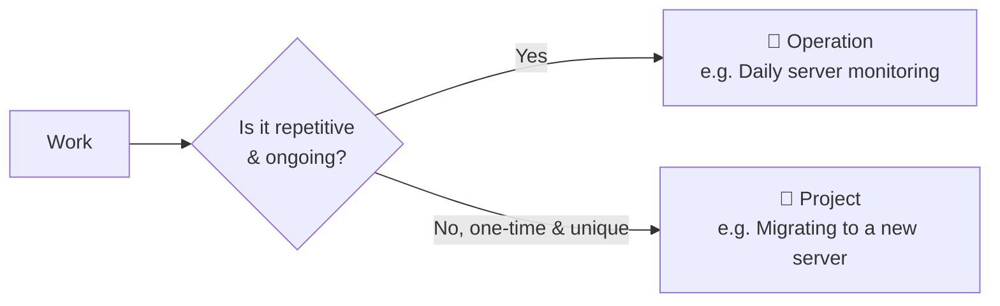

---

### 1.2 Software Project Management (SPM) 🧭

> **Definition:** SPM is the art and discipline of **planning, organising, staffing, monitoring, and controlling** software projects so they are delivered **on time, within budget, and to the required quality**.

**The classic "Iron Triangle" every PM juggles:**

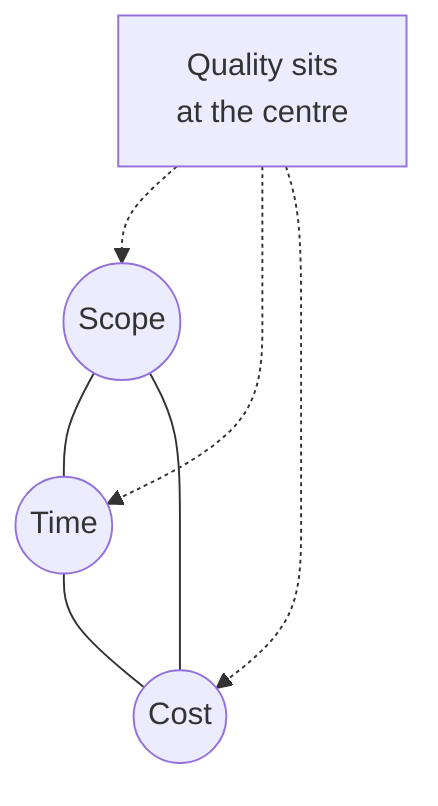

📝 **Know-how:** If a client says *"add 3 new features"* (scope ↑) but *"don't move the deadline"* (time fixed), something else **must** give — usually cost (more people) or quality (more bugs). This trade-off logic is the heart of SPM.

---

### 1.3 Software Projects vs Other (Conventional) Projects 🆚

This is a **favourite exam topic** — software projects are managed differently from, say, building a bridge.

| Factor | 🏗️ Conventional Project (e.g., Construction) | 💻 Software Project |
|---|---|---|
| **Visibility/Tangibility** | Physical progress is visible (walls, floors) | "Invisible" — progress is hard to see until demoed |
| **Product Uniformity** | Built from standard, well-understood materials | Every software system is largely custom-built |
| **Problem Type** | Well-understood engineering problems | Novel, often changing/unclear requirements |
| **Standards & Legal Framework** | Mature legal/engineering standards (decades old) | Comparatively young, less standardised industry |
| **Manufacture vs Build** | Physical manufacture (subject to wear, materials cost) | Purely a design activity — "manufacturing" = copying (cost ≈ 0) |
| **Change Flexibility** | Changes are expensive & difficult after construction starts | Software is comparatively *easy to change* — which paradoxically makes scope creep common |
| **Team Composition** | Stable trades (masons, electricians) | Diverse, evolving skillsets (frontend, backend, AI, DevOps) |

> ⚠️ **Common misconception:** "Software is easy to change, so let's change it anytime." In reality, ease-of-change is a *double-edged sword*: it invites uncontrolled scope creep, which is one of the top reasons software projects fail.

---

### 1.4 Categorization of Software Projects 🗂️

Projects are classified so that the **right management approach** is applied to each. Common categorisation bases:

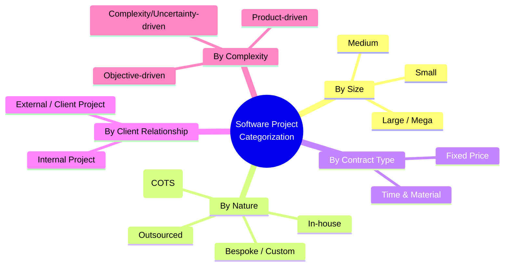

| Category Basis | Example |
|---|---|
| **Size** | A 3-member team building a college result portal (small) vs a national e-governance platform (mega) |
| **Nature** | Bespoke ERP for a single client vs configuring SAP (COTS) |
| **Contract** | Fixed-price website (₹2L, delivered as-is) vs Time & Material consulting (billed per hour) |

📌 **Why it matters:** A **fixed-price** project needs *rigid* upfront planning (Waterfall-friendly), while a **time & material, evolving-requirements** project is better suited to **Agile**.

---

### ✅ Checkpoint — End of Lecture 1

- [ ] Define a *project* in your own words and give one non-software example.
- [ ] List **3 differences** between a software project and a construction project.
- [ ] Categorize this in-class exercise: *"A startup asks you to build a food-delivery app in 4 months, billed per sprint, requirements likely to change."* → Which categories apply? (Size? Nature? Contract type?)

---
---

## 🎯 LECTURE 2 — Setting Objectives, Business Case & Project Portfolio Management

### 2.1 Setting Objectives 🎯

Before *any* planning begins, a project needs a crystal-clear objective. Vague goals ("make the system better") kill projects.

**Use the SMART framework:**


| Bad Objective ❌ | SMART Objective ✅ |
|---|---|
| "Improve the college website" | "Reduce student portal page-load time from 6s to under 2s, and launch by 15 Oct 2026" |
| "Make customers happier" | "Increase app store rating from 3.2 to 4.2 stars within 2 release cycles" |

> 💡 **Know-how:** Objectives sit at the **top** of a hierarchy: *Goals → Objectives → Deliverables → Tasks*. Every task done by a developer should trace back up to an objective — if it doesn't, ask "why are we doing this?"

---

### 2.2 The Business Case 📄

> **Definition:** A **Business Case** is the formal justification document that answers: *"Why should this organisation spend money on this project?"* It is usually written **before** a project is approved.

**Typical contents of a Business Case:**

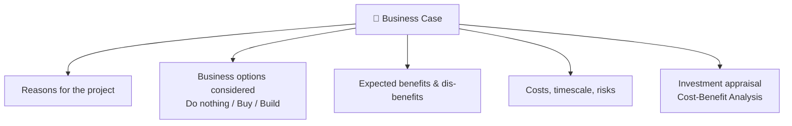

**Mini illustrative example:**
> *"Currently, exam-result processing takes 5 staff-days manually and has a 2% error rate. Building an automated result-processing module (₹8L, 3 months) will cut processing to 4 hours with <0.1% error rate — saving ₹15L/year in staff overtime and reducing student grievances."*

This one paragraph already contains: **problem, option, cost, benefit, timescale** — the DNA of a business case.

---

### 2.3 Project Portfolio Management (PPM) 📊

Real organisations don't run **one** project — they run *dozens*, competing for the same limited people and budget.

> **Definition:** PPM is the **centralized management** of one or more project portfolios to achieve strategic objectives — i.e., deciding **which projects to fund, pause, or kill**.

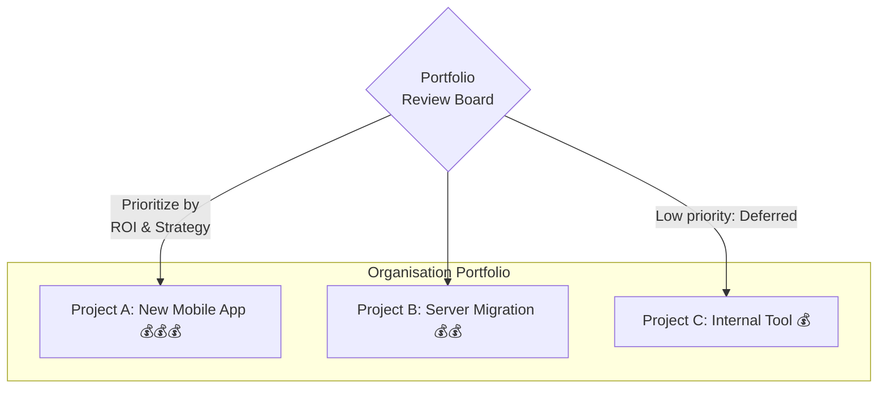

**Why PPM matters:** without it, a company might approve 20 "good" projects that individually make sense but collectively **overload** the team, or fund pet projects that don't align with strategy.

📌 **Exam tip:** PPM operates at the *organisation* level (selecting projects), while Project Management operates at the *individual project* level (executing one project well). Don't confuse the two.

---

### ✅ Checkpoint — End of Lecture 2

- [ ] Rewrite this into a SMART objective: *"We want the app to load faster."*
- [ ] Name 3 things a Business Case must contain.
- [ ] Explain in one line: how is Project Portfolio Management different from Project Management?

---
---

## 🎯 LECTURE 3 — Cost-Benefit Evaluation Techniques

A Business Case is only credible if its numbers are evaluated properly. This lecture covers the **quantitative techniques** used to decide *"is this project financially worth it?"*

### 3.1 Cash Flow Forecasting 💵

Every project is first modelled as a **cash flow**: money going out (development cost) followed by money coming in (benefits/savings), year by year.

| Year | 0 (Now) | 1 | 2 | 3 |
|---|---|---|---|---|
| Cash flow (₹ Lakh) | −20 | +5 | +8 | +12 |

This simple table feeds **every** technique below.

---

### 3.2 Technique 1 — Net Profit 📈

```
Net Profit = Total Benefits (income) − Total Costs
```

Using the table above: Net Profit = (5+8+12) − 20 = **₹5 Lakh**

⚠️ **Limitation:** Ignores *when* the money arrives — ₹5L profit after 10 years is very different from ₹5L profit after 1 year, but Net Profit treats them the same.

---

### 3.3 Technique 2 — Payback Period ⏱️

> Time taken for cumulative benefits to equal the initial investment.

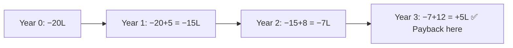

Payback happens **between Year 2 and 3** — roughly **2.6 years**.

✅ Simple & intuitive. ❌ Ignores profits *after* payback and ignores time-value of money.

---

### 3.4 Technique 3 — Return on Investment (ROI) 💹

```
ROI (%) = (Total Benefits − Total Cost) / Total Cost × 100
```

ROI = (25 − 20) / 20 × 100 = **25%**

✅ Easy to compare across projects. ❌ Also ignores *timing* of cash flows.

---

### 3.5 Technique 4 — Net Present Value (NPV) 🏦

> Money **today** is worth more than the same money **in the future** (inflation + opportunity cost). NPV "discounts" future cash back to today's value.

```
Discount Factor (Year n) = 1 / (1 + r)ⁿ        where r = discount rate
NPV = Σ (Cash flow in year n × Discount Factor for year n)
```

**Worked example (r = 10%):**

| Year | Cash Flow (₹L) | Discount Factor @10% | Discounted Value (₹L) |
|---|---|---|---|
| 0 | −20 | 1.000 | −20.00 |
| 1 | +5 | 0.909 | +4.55 |
| 2 | +8 | 0.826 | +6.61 |
| 3 | +12 | 0.751 | +9.02 |
| **NPV** | | | **+0.18** |

Since NPV is (barely) **positive**, the project is financially justified at a 10% discount rate.

🐍 **Quick Python verification (illustrative, minimal):**
```python
def npv(cash_flows, rate):
    """cash_flows[0] is Year-0 outflow; rate is decimal e.g. 0.10"""
    return sum(cf / (1 + rate) ** year for year, cf in enumerate(cash_flows))

flows = [-20, 5, 8, 12]      # in ₹ Lakh
print(round(npv(flows, 0.10), 2))   # -> 0.18
```

---

### 3.6 Technique 5 — Internal Rate of Return (IRR) 📐

> The discount rate **r** at which NPV becomes exactly **zero**. If a project's IRR > the organisation's minimum acceptable rate (cost of capital), it's worth funding.

Think of IRR as *"the break-even interest rate"* of the project — if our example's IRR ≈ 10.4%, and the company's cost of capital is 8%, the project clears the bar. ✅

---

### 📊 Technique Comparison at a Glance

| Technique | Considers Timing of Money? | Output | Best For |
|---|---|---|---|
| Net Profit | ❌ | ₹ amount | Quick sanity check |
| Payback Period | ❌ | Time (years) | Cash-flow-sensitive orgs |
| ROI | ❌ | % | Comparing project efficiency |
| **NPV** | ✅ | ₹ amount | Most rigorous financial comparison |
| **IRR** | ✅ | % (rate) | Comparing against cost of capital |

---

### ✅ Checkpoint — End of Lecture 3

- [ ] Given costs = ₹10L (Year 0) and benefits = ₹4L, ₹4L, ₹4L (Years 1–3), calculate the **Payback Period**.
- [ ] Why does NPV give a more trustworthy answer than plain Net Profit?
- [ ] In one line, define IRR without using the word "discount rate" twice.

---
---

## 🎯 LECTURE 4 — Risk Evaluation & Selecting the Right Project Approach

### 4.1 What is Risk? ⚠️

> **Risk** = an **uncertain event** that, if it occurs, has a **positive or negative effect** on project objectives.

`Risk ≠ Problem`. A **problem** has already happened; a **risk** is something that *might* happen.

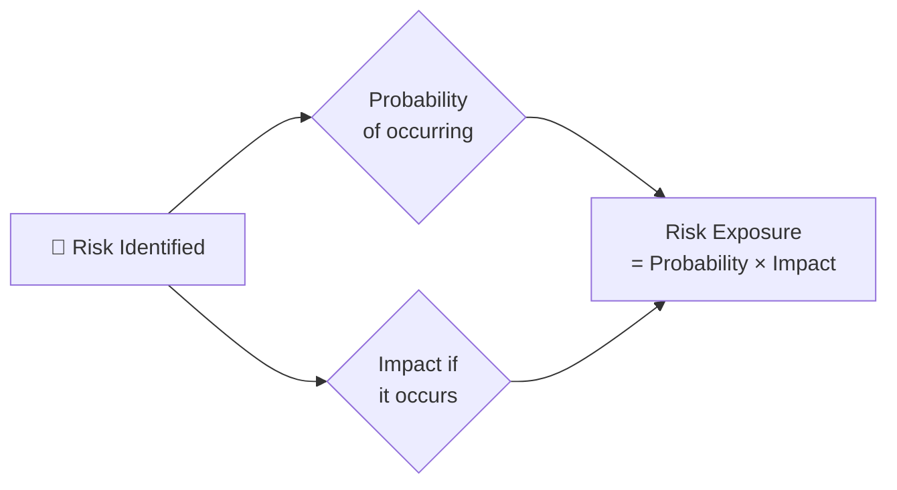

---

### 4.2 The Risk Management Process 🔄

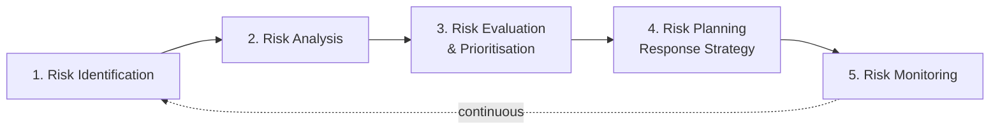

**Step 1 — Identification:** Brainstorm what could go wrong.
*Example risks:* Key developer resigns · Third-party API changes · Requirements keep changing · Server downtime.

**Step 2 & 3 — Analysis and the Probability–Impact Matrix:**

| | **Low Impact** | **Medium Impact** | **High Impact** |
|---|---|---|---|
| **High Probability** | 🟡 Monitor | 🟠 Act Soon | 🔴 Act Now |
| **Medium Probability** | 🟢 Accept | 🟡 Monitor | 🟠 Act Soon |
| **Low Probability** | 🟢 Accept | 🟢 Accept | 🟡 Monitor |

*Example:* "Lead developer resigns mid-project" → Low probability, but High impact → 🟡 **Monitor closely** and prepare a knowledge-transfer/backup plan.

---

### 4.3 Risk Response Strategies (the 4 T's) 🛡️

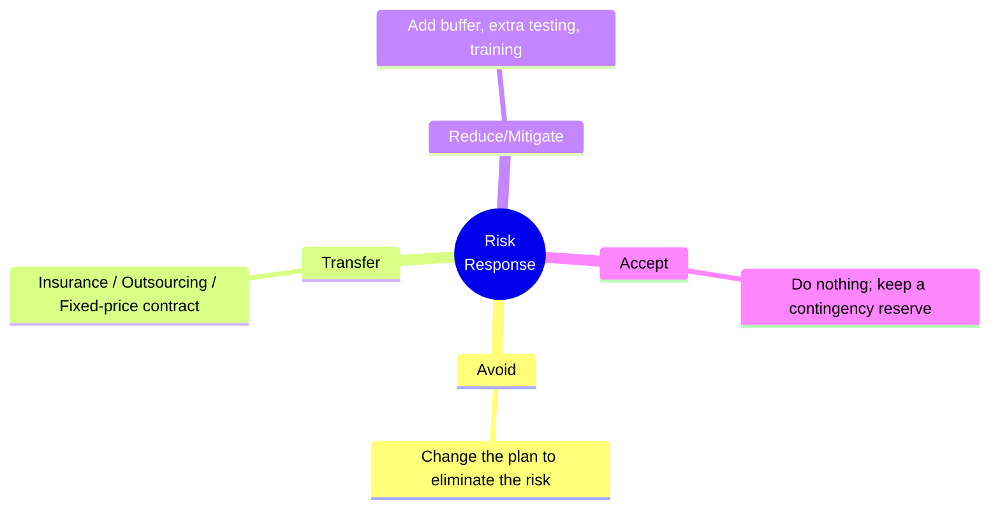

📝 **Know-how:** For a *low probability, high impact* risk like "production server catches fire," **Transfer** (cloud hosting + insurance) is usually cheaper than trying to Avoid it entirely.

---

### 4.4 Selection of an Appropriate Project Approach 🧩

Once risk and objectives are clear, the PM must choose **how** the project will be executed. Key decision factors:

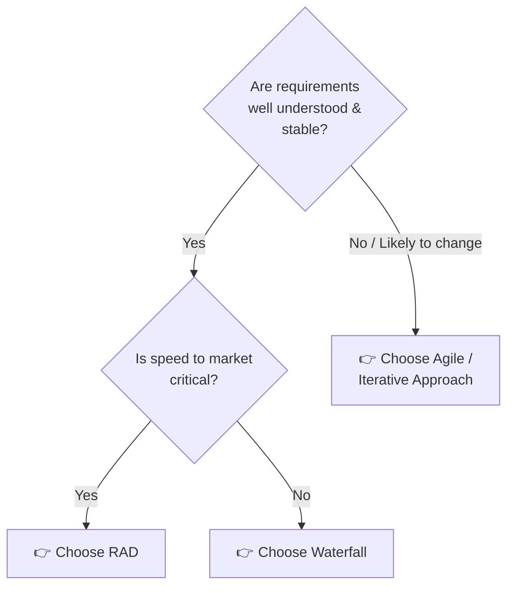

| Decision Factor | Favors Plan-Driven (Waterfall) | Favors Agile/Iterative |
|---|---|---|
| Requirement stability | Stable, well-documented | Volatile, evolving |
| Client involvement | Low/upfront only | Continuous |
| Regulatory/contractual needs | High (defence, banking) | Low–medium |
| Team experience | Junior teams (need structure) | Experienced, self-organising teams |
| Time-to-market pressure | Low | High |

Other approach decisions include **Build vs Buy** (develop in-house vs purchase COTS software) and **contract type** (Fixed-Price vs Time & Material — covered in Lecture 2's categorization).

---

### ✅ Checkpoint — End of Lecture 4

- [ ] Differentiate *Risk* from *Problem* with one example each.
- [ ] Place this risk on the Probability–Impact matrix: *"Cloud provider has 99.99% uptime SLA, but if it goes down, our entire e-commerce platform stops."*
- [ ] Which response strategy (Avoid/Transfer/Reduce/Accept) fits: *"Buying server insurance"*?

---
---

## 🎯 LECTURE 5 — Project Life Cycle Models

### 5.1 The Generic Project Life Cycle 🔄

Every project — regardless of model — flows through broad phases:

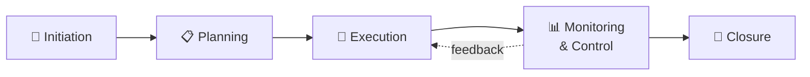

The models below differ in **how Execution and Monitoring are structured** — sequential, in loops, or in short cycles.

---

### 5.2 Waterfall Model 🌊

> A **strictly sequential** model — each phase must fully complete before the next begins.

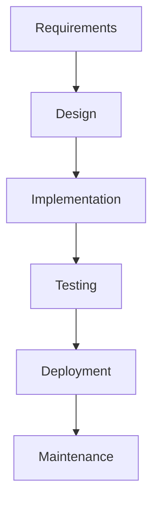

| ✅ Pros | ❌ Cons |
|---|---|
| Simple, easy to manage & document | Very rigid — late changes are costly |
| Clear milestones for client sign-off | Working software seen only at the very end |
| Works well for stable requirements | High risk if requirements were misunderstood |

**Best for:** Government/defence projects with fixed, well-documented requirements.

---

### 5.3 Spiral Model 🌀

> Combines iterative development with **systematic risk analysis** at every loop ("spiral").

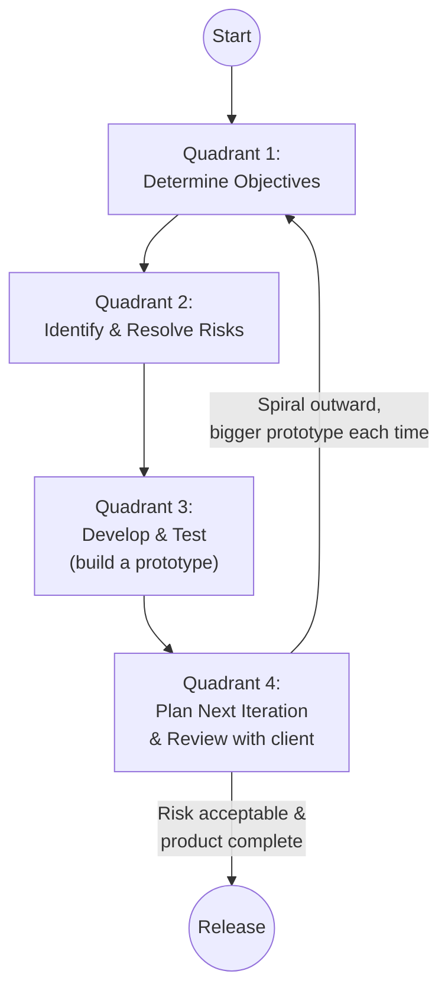

| ✅ Pros | ❌ Cons |
|---|---|
| Strong emphasis on **risk management** | Complex to manage — needs risk-assessment expertise |
| Good for large, high-risk projects | Can be costly (repeated risk analysis cycles) |

**Best for:** Large, high-risk, high-budget projects (e.g., aerospace, novel R&D software).

---

### 5.4 RAD Model (Rapid Application Development) ⚡

> Prioritises **fast delivery** using component reuse and heavy user involvement, over a short (60–90 day) timebox.

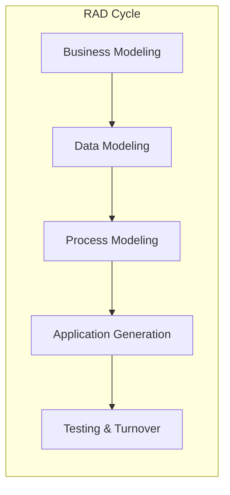

| ✅ Pros | ❌ Cons |
|---|---|
| Very fast delivery | Needs a strong, modular team + reusable components |
| Heavy customer feedback loop | Not suitable for projects that can't be modularised |
| Reduced risk via early prototypes | Requires higher budget for skilled resources |

**Best for:** Projects with clear modules and a need for a system in 2–3 months (e.g., internal admin dashboards).

---

### 5.5 Agile Model 🔁

> Delivers working software in **short, fixed-length iterations ("Sprints")**, embracing changing requirements even late in development.

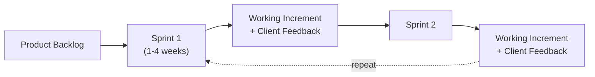

| ✅ Pros | ❌ Cons |
|---|---|
| Embraces changing requirements | Harder to predict final cost/date upfront |
| Continuous client feedback | Needs highly engaged, available customer |
| Working software early & often | Documentation can be neglected |

**Best for:** Startups, product companies, evolving/unclear requirements.

---

### 5.6 Side-by-Side Comparison 📋

| Model | Flexibility to Change | Client Involvement | Risk Handling | Delivery Speed |
|---|---|---|---|---|
| 🌊 Waterfall | Very Low | Low (only start/end) | Weak | Slow (all at once) |
| 🌀 Spiral | Medium | Medium | **Excellent (built-in)** | Medium |
| ⚡ RAD | Medium | High | Medium | **Very Fast** |
| 🔁 Agile | **Very High** | **Very High** | Good (incremental) | Fast (sprint-by-sprint) |

---

### 🧠 Unit I — Full Recap Mind-Map

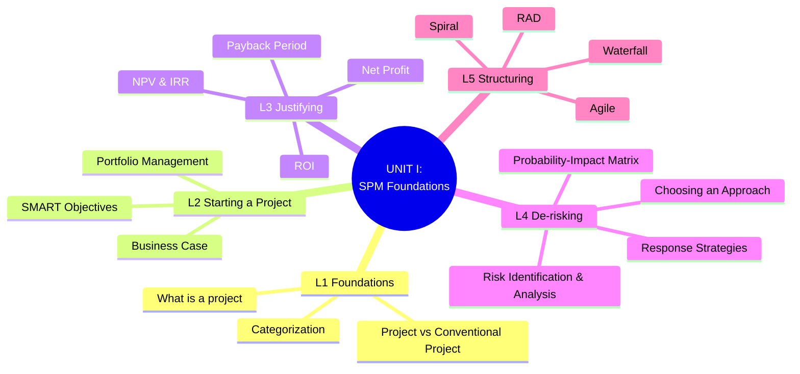

---

### ✅ Checkpoint — End of Lecture 5 (Unit I Wrap-up)

- [ ] Draw the Waterfall model phases from memory.
- [ ] Which life cycle model would you choose for a **fintech startup MVP** with unclear requirements, and why?
- [ ] Explain why the **Spiral model** is considered the most risk-driven of the four models.
- [ ] **Unit I Recap Quiz (self-test, 5 questions):**
  1. Name two differences between software and conventional projects.
  2. What does SMART stand for?
  3. Which cost-benefit technique accounts for the time-value of money?
  4. What is Risk Exposure a function of?
  5. Name the model best suited for a project with fixed, well-documented government requirements.

---

## 📚 Suggested Practice for Students
1. Take any mobile app idea and write a 150-word **Business Case** for it.
2. For a hypothetical ₹15L project earning ₹6L/₹6L/₹6L over 3 years, calculate **NPV at 12%** and **Payback Period**.
3. Pick a real risk in your own mini-project (college project) and place it on the Probability–Impact matrix.
4. Compare Waterfall vs Agile for your own capstone project and justify your choice in 5 lines.
